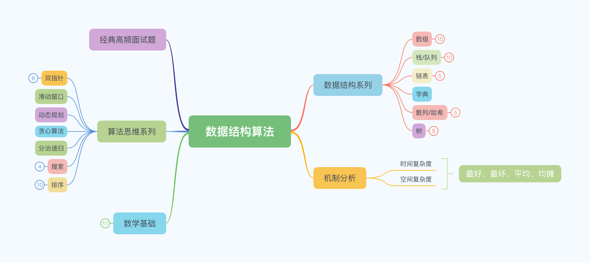

# 算法导航

## 算法进阶小白

关于算法，不言而喻，是至关重要的。

关于自己学习算法的方法论，最重要的是建立算法知识脑图，如下图：

建立一套完整、属于自己的体系。其次就是采用**追溯法**，对于自己不知道的知识通过各种比较权威的文章进行学习。最后就是**不断练习、不断coding、不断回顾。**

练习的渠道个人选择的是[**LeetCode**](https://leetcode-cn.com/)**，**对于不同的类型的题目进行归类之外，还可以互相学习，有一些知识点归纳的小册也是自己学习的选项。

最后，也是最重要的 **坚持 坚持 坚持 ！！！**

**本站已刷题目**



1. 🐵 [simple 1.两数之和](https://leetcode-cn.com/problems/two-sum/)             
2. 🐵 [simple 26. 删除排序数组中的重复项 ](https://leetcode-cn.com/problems/remove-duplicates-from-sorted-array/)
3. 🐵 [simple 27. 移除元素](https://leetcode-cn.com/problems/remove-element/)
4. 🐵 [simple 35. 搜索插入位置](https://leetcode-cn.com/problems/search-insert-position/)
5. 🐵 [simple 66. 加一](https://leetcode-cn.com/problems/plus-one/)
6. 🐵 [simple 88. 合并两个有序数组](https://leetcode-cn.com/problems/merge-sorted-array/)
7. 🐵 [simple 121. 买卖股票的最佳时机](https://leetcode-cn.com/problems/best-time-to-buy-and-sell-stock/)
8. 🐵 [simple 122. 买卖股票的最佳时机 II](https://leetcode-cn.com/problems/best-time-to-buy-and-sell-stock-ii/)
9. 🐵 [simple 167. 两数之和 II - 输入有序数组](https://leetcode-cn.com/problems/two-sum-ii-input-array-is-sorted/)
10. 🐵 [simple 169. 多数元素](https://leetcode-cn.com/problems/majority-element/)
11. 🐵 [simple 217. 存在重复元素](https://leetcode-cn.com/problems/contains-duplicate/)
12. 🐵 [simple 219. 存在重复元素 II](https://leetcode-cn.com/problems/contains-duplicate-ii/)
13. 🐵 [simple 268. 丢失的数字](https://leetcode-cn.com/problems/missing-number/)
14. 🐵 [simple 283. 移动零](https://leetcode-cn.com/problems/move-zeroes/)
15. 🐵 [simple 350. 两个数组的交集 II](https://leetcode-cn.com/problems/intersection-of-two-arrays-ii/)
16. 🐵 [simple 374. 猜数字大小](https://leetcode-cn.com/problems/guess-number-higher-or-lower/)
17. 🐵 [simple 414. 第三大的数](https://leetcode-cn.com/problems/third-maximum-number/)
18. 🐵 [simple 448. 找到所有数组中消失的数字](https://leetcode-cn.com/problems/find-all-numbers-disappeared-in-an-array/)
19. 🐵 [simple 485. 最大连续1的个数](https://leetcode-cn.com/problems/max-consecutive-ones/)
20. 🐵 [simple 509. 斐波那契数](https://leetcode-cn.com/problems/fibonacci-number/)
21. 🐵 [simple 561. 数组拆分 I](https://leetcode-cn.com/problems/array-partition-i/)
22. 🐵 [simple 566. 重塑矩阵](https://leetcode-cn.com/problems/reshape-the-matrix/)
23. 🐵 [simple 605. 种花问题](https://leetcode-cn.com/problems/can-place-flowers/)
24. 🐵 [simple 628. 三个数的最大乘积](https://leetcode-cn.com/problems/maximum-product-of-three-numbers/)
25. 🐵 [simple 665. 非递减数列](https://leetcode-cn.com/problems/non-decreasing-array/)
26. 🐵 [simple 674. 最长连续递增序列](https://leetcode-cn.com/problems/longest-continuous-increasing-subsequence/)
27. 🐵 [simple 面试题 01.01. 判定字符是否唯一](https://leetcode-cn.com/problems/is-unique-lcci/)
28. 🐵 [simple 面试题 01.02. 判定是否互为字符重排](https://leetcode-cn.com/problems/check-permutation-lcci/)
29. 🐵 [simple 剑指 Offer 53 - I. 在排序数组中查找数字 I](https://leetcode-cn.com/problems/zai-pai-xu-shu-zu-zhong-cha-zhao-shu-zi-lcof/)
30. 🐵 [simple 剑指 Offer 53 - II. 0～n-1中缺失的数字](https://leetcode-cn.com/problems/que-shi-de-shu-zi-lcof/)
31. 🐵 [simple 724. 寻找数组的中心索引](https://leetcode-cn.com/problems/find-pivot-index/)
32. 🐵 [simple 1002. 查找常用字符](https://leetcode-cn.com/problems/find-common-characters/)
33. 🙈 [medium 581. 最短无序连续子数组](https://leetcode-cn.com/problems/shortest-unsorted-continuous-subarray/)
34. 🙈 [medium 189. 旋转数组](https://leetcode-cn.com/problems/rotate-array/)
35. 🙈 [medium 532. 数组中的 k-diff 数对](https://leetcode-cn.com/problems/k-diff-pairs-in-an-array/)

  



1. [剑指 Offer 59 - II. 队列的最大值](https://leetcode-cn.com/problems/dui-lie-de-zui-da-zhi-lcof/solution/)



1. 🌴 [701. 二叉搜索树中的插入操作](https://leetcode-cn.com/problems/insert-into-a-binary-search-tree/)
2. 🌴 [450. 删除二叉搜索树中的节点](https://leetcode-cn.com/problems/delete-node-in-a-bst/)
3. 🌴 [700. 二叉搜索树中的搜索](https://leetcode-cn.com/problems/search-in-a-binary-search-tree/)
4. 🌴 [100. 相同的树](https://leetcode-cn.com/problems/same-tree/)
5. 🌴 [98. 验证二叉搜索树](https://leetcode-cn.com/problems/validate-binary-search-tree/)
6. 🌴 [剑指 Offer 27. 二叉树的镜像](https://leetcode-cn.com/problems/er-cha-shu-de-jing-xiang-lcof/)
7. 🌴 [226. 翻转二叉树](https://leetcode-cn.com/problems/invert-binary-tree/)
8. 🌴 [剑指 Offer 55 - I. 二叉树的深度](https://leetcode-cn.com/problems/er-cha-shu-de-shen-du-lcof/)
9. 🌴 [1038. 从二叉搜索树到更大和树](https://leetcode-cn.com/problems/binary-search-tree-to-greater-sum-tree/)



1. 🚴 [3. 无重复字符的最长子串](https://leetcode-cn.com/problems/longest-substring-without-repeating-characters/)
2. 🚴 [76. 最小覆盖子串](https://leetcode-cn.com/problems/minimum-window-substring/)
3. 🚴 [424. 替换后的最长重复字符](https://leetcode-cn.com/problems/longest-repeating-character-replacement/)
4. 🚴 [438. 找到字符串中所有字母异位词](https://leetcode-cn.com/problems/find-all-anagrams-in-a-string/)
5. 🚴 [1004. 最大连续1的个数 III](https://leetcode-cn.com/problems/max-consecutive-ones-iii/solution/)
6. 🚴 [面试题 17.18. 最短超串](https://leetcode-cn.com/problems/shortest-supersequence-lcci/)
7. 🚴 [剑指 Offer 59 - I. 滑动窗口的最大值](https://leetcode-cn.com/problems/hua-dong-chuang-kou-de-zui-da-zhi-lcof/)
8. 🚴 [剑指 Offer 48. 最长不含重复字符的子字符串](https://leetcode-cn.com/problems/zui-chang-bu-han-zhong-fu-zi-fu-de-zi-zi-fu-chuan-lcof/)



