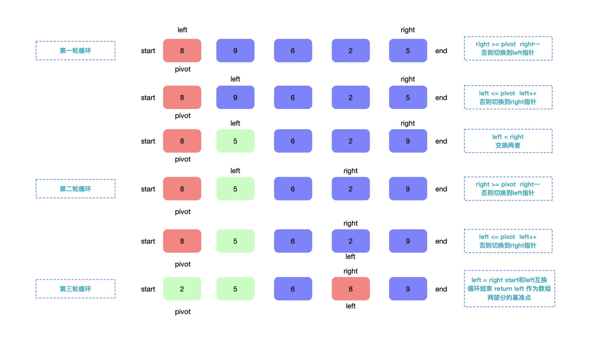
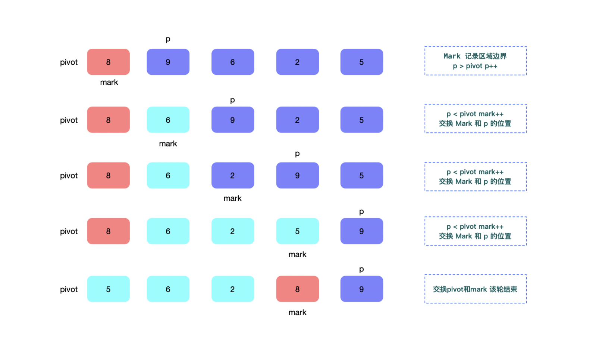

# 排序算法

排序算法是日常开发中常用的一种算法。排序算法有很多种，冒泡、选择、插入、快速、归并以及希尔排序等。每种排序算法都有一定的优缺点。首先从最简单的冒泡排序开始。

### 冒泡排序

下图为动图演示


排序冒泡会有两层循环，分为外循环和内循环。外循环负责整个数组的循环，内循环的区间随着外循环的区间变化而变化，内循环判断相邻元素大小，从而进行元素互换。

```javascript
// 元素交换
function swap(arr, a, b) { 
  let tmp = arr[a];
  arr[a] = arr[b];
  arr[b] = tmp;
}
```

内循环判断相邻元素之间的大小 ，从而进行位置互换

```javascript
// 冒泡算法 解法一
function bubbleSort(arr) {
  for (let i = 0; i < arr.length; i++) {
    for (let j = 0; j < arr.length - 1; j++) {   
      if(arr[j] > arr[j + 1])  {   
        swap(arr, j, j+1)
      }
    }
  }
}
```

解法一的时间复杂度为

$$
O（n）= n * (n - 1)
$$

从动态图中不难发现，外循环每循环一次，数组后面的元素的顺序已经排好了，因此这是一部分没有必要的循环，可以在解法一的基础上优化，降低时间复杂度

```javascript
// 冒泡算法 解法二 优化时间复杂度
function bubbleSort(arr) {
  console.time('bubble start')
  for (let i = 0; i < arr.length; i++) {
    for (let j = 0; j < arr.length - 1 - ; j++) {   
      if(arr[j] > arr[j + 1])  {   
        swap(arr, j, j+1)
      }
    }
  }
  console.timeEnd('bubble start')
}
```

可以看到，解法二在内循环的区间随着外循环的区间变化，这样内循环的判断就是在未排序好的区间进行循环，这样最大限度的节省了时间复杂度

### 选择排序

下图为动图展示


可以看到，选择排序也是两重循环，外循环的第一个元素和内循环剩下的元素进行比较，将最小的元素放到第一个位置上，以此类推。

```javascript
// 选择排序
function selectSort(arr) {
  console.time('select start')
  let min
  for (let i = 0; i < arr.length - 1; i++) {
    min = i;
    for (let j = i + 1; j < arr.length; j++) {
      if(arr[min] > arr[j]) {
        min = j
      }
    }
    swap(arr, i, min)
  }
  console.timeEnd('select start')
}
```

### 插入排序

下图为动图展示


插入排序也有两层循环，外层循环遍历每一个元素，内层循环对外层循环选中的选中的元素跟前一个元素 进行比较，如果选中的元素小于前一个元素，则将前一个元素后移，以此类推。

```javascript
// 插入排序
function insertSort(arr) {
  console.time('insert start')
  let tmp, inner;
  for (let outer = 1; outer < arr.length; outer++) {
    const tmp = arr[outer];
    let inner = outer
    while (inner > 0 && arr[inner - 1] > tmp) {
      arr[inner] = arr[inner - 1]
      inner--
    }
    arr[inner] = tmp
  }
  console.timeEnd('insert start')
}
```

### 三种基本排序算法耗时

这三种基本排序算法基本已经写完了，但是哪个是最优的呢，下面通过耗时来进行比较

```javascript
// 生成随机数组
function randomArr(num) {
  let arr = []
  for (let i = 0; i < num; i++) {
    arr[i] = Math.floor(Math.random() * (num+1))
  }
  return arr
}
// 生成100个随机数
let testArr = randomArr(100);
bubbleSort(testArr); // bubble start: 0.76513671875 ms
selectSort(testArr); // select start: 0.239990234375 ms
insertSort(testArr); // insert start: 0.02197265625 ms

// 生成1000个随机数
let testArr = randomArr(1000);
bubbleSort(testArr); // bubble start: 4.07421875 ms
selectSort(testArr); // select start: 3.81494140625 ms
insertSort(testArr); // insert start: 4.828125 ms

// 生成10000个随机数
let testArr = randomArr(1000);
bubbleSort(testArr); // bubble start: 162.80908203125 ms
selectSort(testArr); // select start: 83.802001953125 ms
insertSort(testArr); // insert start: 0.68994140625 ms
```

可以看到，随着测试数量的增加，插入排序的耗时越来越少，在测试数量较少时，三种算法的耗时差不多。不过判断哪种算法最优，还要进行大量的数据进行测试。

### 快速排序

快速排序是处理大量数据最快的一种算法，其核心思想是分而治之，采用递归的方式将数组分为多个单元，每个单元进行排序，最终依次将每个单元合并。


算法过程：

1. 找到一个基准值（pivot），将待排序数组分成两个字数组
2. 将小于基准值的值放到左子数组中，大于基准值的值放到右子数组中。依次类推，最终将各个子数组合并

```javascript
// 快速排序
const quickSort = (arr) => {
  if(!arr.length) return [];

  let leftArr = [], rightArr = [];
  let pivot = arr[0]

  for (let i = 1; i < arr.length; i++) {
    if(arr[i] <= pivot) {
      leftArr.push(arr[i])
    }else {
      rightArr.push(arr[i])
    }
  }
  return quickSort(leftArr).concat(pivot, quickSort(rightArr))
}
```

该快速排序中在递归中使用了额外的空间，有没有一种方式在原地进行操作。

下面有两种方式进行原地操作：

* 双边循环法
* 单边循环法

#### 双边循环法

双边循环法是在[对撞指针](../suan-fa-ji-qiao-xi-lie/shuang-zhi-zhen-mo-shi.md)的基础上，根据基准点（一般第一个元素），将小于基准点的元素移动到其左侧，大于基准点的元素移动到其右侧。

```javascript
const quickSortMain = (arr) => {
  let start = 0;
  let len = arr.length;
  let end = len - 1;
  
  quickSort(arr, start, end);
}

const quickSort = (arr, start, end) => {
  if(start >= end) return;
  // 计算基准值
  let pivot = partition(arr, start, end);
  
  quickSort(arr, start, pivot - 1);
  quickSort(arr, pivot + 1, end);
}
```

如下图 计算下一轮递归的基准值



首先从`right` 右指针开始，对比基准点 pivot ，大于基准点 `right` 指针向左侧移动，否则移动左指针 `left` 。

如果`left` 小于基准点 `pivot` ，`left` 左指针向右侧移动，直到`left` 大于基准点。

此时，`left` 小于 `right`，则交换两者的值。进行下一轮循环，直到 `left` 和 `right` 相等。

最后，交换基准值和left对应的值，这样基准值左侧就是小于其值的，右侧是大于其值的。最后返回left 作为下一轮递归的基准点。

```javascript
const partition = (arr, start, end) => {
  let left = start;
  let right = end;
  let pivot = arr[start];
  
  while(left != right) {
    
    while(left < right && arr[right] > pivot) {
      right--;
    }
    
    while(left < right && arr[left] < pivot) {
      left++;
    }
    
    if(left < right) {
      let tmp = arr[left];
      arr[left] = arr[right];
      arr[right] = tmp
    }
  }
  
  arr[start] = arr[left];
  arr[left] = pivot;
  
  return left;
}
```

#### 单边循环法

单边循环法是使用一个单指针来遍历，同时`pivot`基准元素也是取的第一位，增加了 `mark` 指针，来标记基准元素左右的边界。如下图，计算第一次获取边界值的循环



首先记录`pivot`和`mark`指针为首位，循环指针`p`为`pivot`的下一位，判断 `p` 和 `pivot`的大小。

如果 `p` 大于 `pivot`，`p` 继续移动；`p` 小于 `pivot`，`mark`移动一位，之后交换`p`和`mark`的值，这样`mark`边界区分了基准值左右两侧的值。

以此类推，直到`p`移动结束，交换`pivot`和`mark`的值，最终得到了下一轮循环的基准值。

```javascript
// 这里实现单边循环 其他递归方式以及条件跟上述一致
const partition_single = (arr, start, end) => {

  let pivot = arr[start];
  let mark = start;

  for (let p = start + 1; p <= end; p++) {
    if(arr[p] < pivot) {
      mark++;
      let tmp = arr[p];
      arr[p] = arr[mark];
      arr[mark] = tmp;
    }
  }
  arr[start] = arr[mark];
  arr[mark] = pivot；

  return mark
}
```


