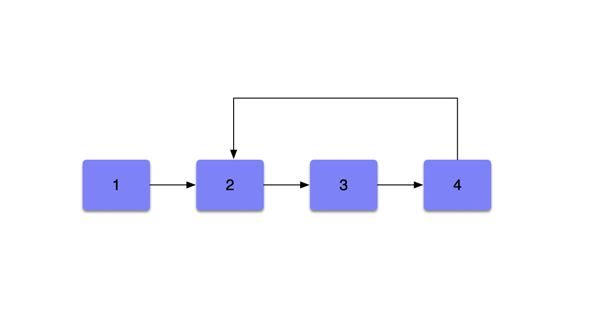
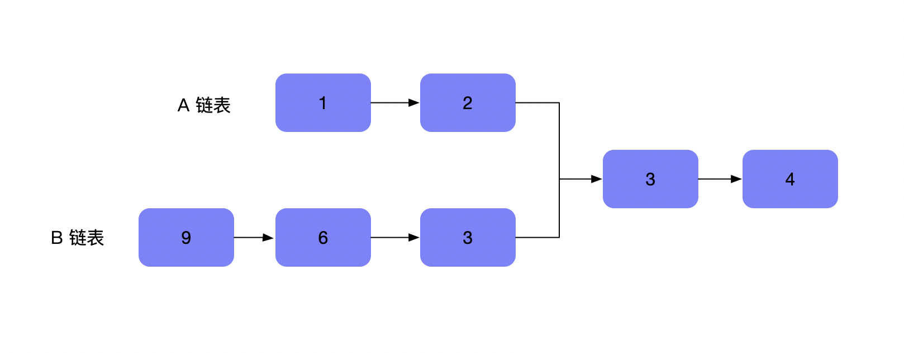
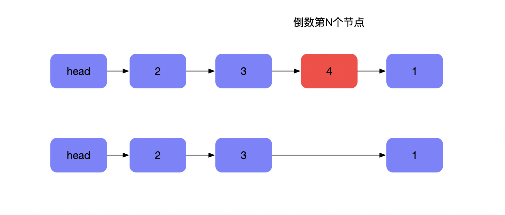
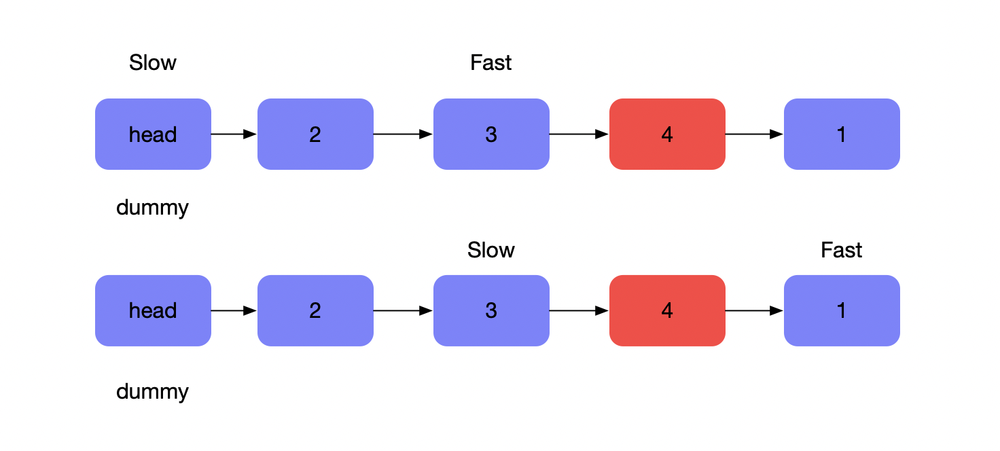
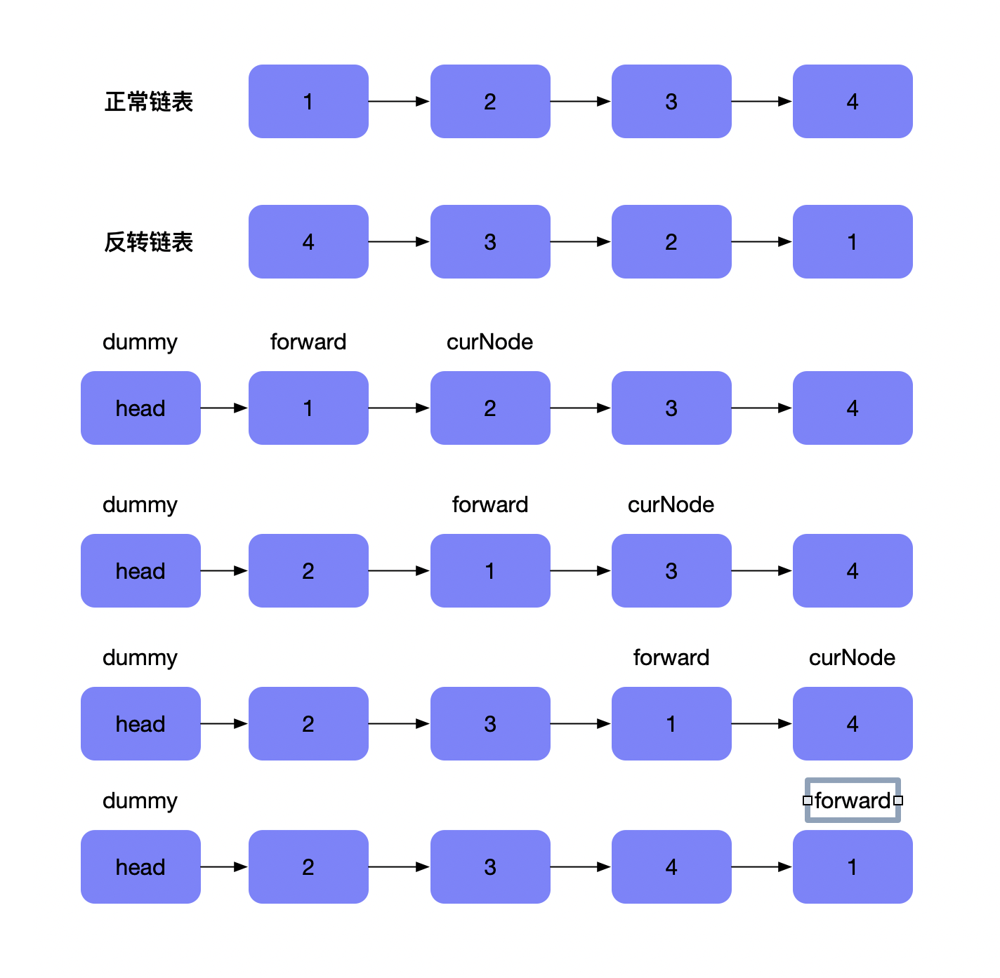
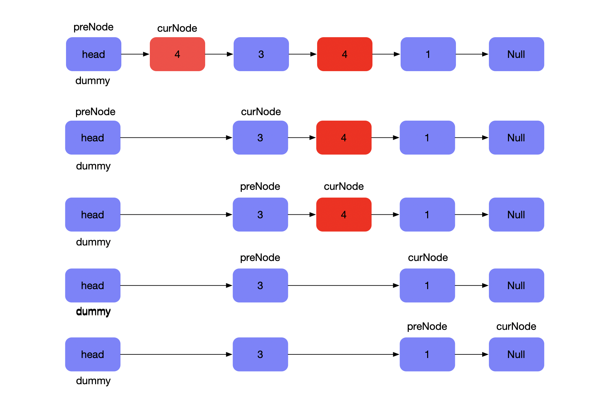
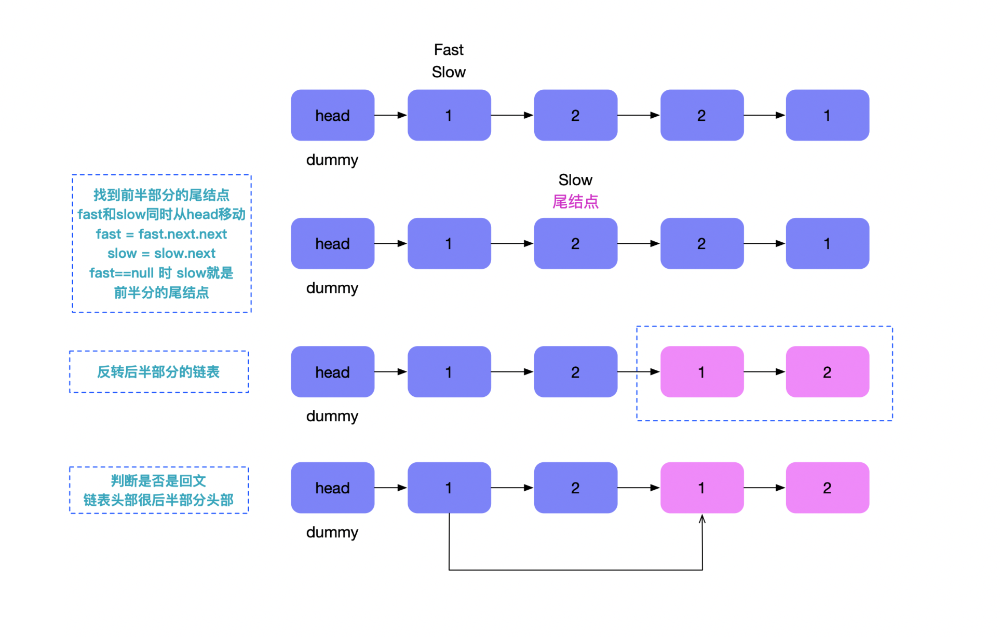

# 链表结构及算法

链表是一种线性存储结构，元素未存储的在连续的内存块中，而是通过类似指针的方式连接每一个节点


### 单链表

单链表是链表一种表现形式，是单向的，最后的节点执行 `null` ，除非出现环形链表。

### 单链表的实现

```javascript
// 链表
// 伪代码 结构
var linkList = {
  data: 'head',
  next: {
    data: 'first',
    next: {
      data: 'second',
      next: null
    }
  }
}a

// 结点 - 内存块
function Node(element) {
  this.data = element;
  this.next = null;
}

function LinkList() {
  // 头结点
  this.head = new Node('head');

}

// 链表尾结点新增结点
LinkList.prototype.append = function (newElement) {
  var newNode = new Node(newElement);
  var curNode = this.head;
  while (curNode.next) {
    curNode = curNode.next;
  }
  curNode.next = newNode;
}


// 通过结点值查找结点
LinkList.prototype.findByValue = function (value) {
  // 遍历 从头结点

  var curNode = this.head.next;
  while (curNode != null && curNode.data != value) {
    curNode = curNode.next;
  }
  return curNode === null ? -1 : curNode;
}

// 通过index查找结点
LinkList.prototype.findByid = function (index) {
  var curNode = this.head.next;
  var pos = 0;
  while (curNode !== null && pos !== index) {
    curNode = curNode.next;
    pos++;
  }
  return curNode === null ? -1 : curNode;
}

// 查找指定结点的上一个结点
LinkList.prototype.findPrev = function (value) {
  var curNode = this.head;

  while (curNode.next !== null && curNode.next.data !== value) {
    curNode = curNode.next;
  }
  if (curNode.next === null) {
    return -1;
  }
  return curNode;
}

// 移除指定结点
LinkList.prototype.remove = function (value) {
  var prevNode = this.findPrev(value);
  if (prevNode == -1) {
    console.log('未找到结点');
    return
  }
  prevNode.next = prevNode.next.next;
}

// 遍历链表结构
LinkList.prototype.diaplay = function () {
  var curNode = this.head.next;
  while (curNode !== null) {
    console.log(curNode.data);
    curNode = curNode.next
  }
}


// 指定结点之后插入结点
LinkList.prototype.insert = function (newElement, element) {
  var curNode = this.findByValue(element);

  if (curNode == -1) {
    console.log('未找到结点');
    return;
  }
  var newNode = new Node(newElement);
  newNode.next = curNode.next;
  curNode.next = newNode;
}


var LLinkList = new LinkList();

console.log(LLinkList)

LLinkList.append('first');
LLinkList.append('second');
LLinkList.append('third');
LLinkList.append('five');


LLinkList.insert('four', 'third');
var findValue = LLinkList.findByValue('second');
console.log(findValue)

var findPrev = LLinkList.findPrev('four');
console.log(findPrev)

LLinkList.remove('first')

LLinkList.diaplay()
```

### 链表中双指针技巧

[双指针技巧](../suan-fa-ji-qiao-xi-lie/shuang-zhi-zhen-mo-shi.md)在链表的使用只能采用**快慢指针**的模式。这里收集了利用**双指针**解题的算法题。

* [环形链表](ttps://leetcode-cn.com/problems/linked-list-cycle/)
* [环形链表II](https://leetcode-cn.com/problems/linked-list-cycle-ii/solution/)
* [相交链表](https://leetcode-cn.com/problems/intersection-of-two-linked-lists/)
* [删除链表的倒数第N个节点](https://leetcode-cn.com/problems/remove-nth-node-from-end-of-list/)

### 环形链表

环形链表可以判断一个单链表是否有环，见下图



在考虑到空间复杂度，可以在当前内存中使用快慢指针技巧快速判断。

此方法可以称之为[Floyd 判圈算法](https://zh.wikipedia.org/wiki/Floyd%E5%88%A4%E5%9C%88%E7%AE%97%E6%B3%95)

```javascript
const hasCycle = function(head) {
  if(head == null || head.next) return false;
  // 慢指针
  let slow = head;
  // 快指针
  let fast = head.next;
  // 快慢指针相遇 则说明有环
  while(slow != fast) {
    if(fast == null || fast.next == null) return false;
    
    slow = slow.next;
    fast = fast.next.next;
  }
  
  return true
}
```

### 环形链表II

环形链表II 在之前的基础上要**返回入环的第一个节点，也就是下面的`节点2`** 


在确认链表有环的前提下，新增一个指针，从链表头部开始移动，同时与快慢指针相遇的节点移动，最终两者都会相遇，相遇节点就是入环的第一个节点。

```javascript
const detectCycle1 = (head) => {
  if(head == null || head.next == null) return null;
  let slow = head;
  let fast = head;
  // 判断是否有环
  while(fast !== null) {
    slow = slow.next;
    if(fast.next == null) return null;
    fast = fast.next.next;
    // 快慢节点向右 判断有环
    if(slow == fast) {
      let curNode = head;
      // 寻找入环的第一个节点
      while(slow != curNode) {
        slow = slow.next;
        curNode = curNode.next;
      }
      return slow;
    }
  }
  return null;
}
```

### 相交链表

如下图，两个单链表相交，返回相交的起始节点



比较简单的方式可以用哈希表，不过这种方式额外增加了空间复杂度，最优的解法是在原地进行操作，也就是使用双指针模式。

A链表和B链表同时进行遍历，循环结束的条件是A链表和B链表当前的节点相同。

```javascript
const getIntersectionNode = (headA, headB) => {
  if(headA == null || headB == null) return null;
  
  let nodeA = headA;
  let nodeB = headB;
  
  while(nodeA != nodeB) {
     nodeA = nodeA !== null ? nodeA.next : headB;
     nodeB = nodeB !== null ? nodeB.next : headA;
  }
  
  return nodeA
}
```

上面循环体中当链表A到达尾部的时候，将链表B头结点指向nodeA，同理链表B到达尾结点时，将链表A头结点指向B，这样下次循环的时候两个链表一定会相遇。

### 删除链表的倒数第N个节点

如下图，需要删除`4`这个节点




一种简单的思路是**计算链表的长度**，得到需要删除节点的顺序位置，然后再遍历链表，删除节点

```javascript
const removeNthFromEnd = function(head, n) {
  if(head == null || head.next == null) return head.next;
  
  let size = 0;
  let index = 0;
  let fast = head;
  let slow = head;
  
  while(curNode !== null) {
    size++;
    curNode = curNode.next;
  }
  
  while(slow.next !== null) {
    if(index == size - n - 1) {
      slow.next = slow.next.next;
      return head;
    }
    index++;
    slow = slow.next
  }
  return head.next
}
```

这种方式是比较简单易理解的，时间和空间复杂度上分别为`O(L)` `O(1)`  。

另一种方式就是**双指针模式，**定义快慢指针，以及哨兵节点（方便处理链表）



先让快指针移动 `n`个步骤，这样之后快慢指针同时移动，直到快指针指向`null` ，此时慢指针指向的就是待删除的节点。如下图，为了方便删除节点，给链表头部新增了`dummy` 节点。

```javascript
const removeNthFromEnd1 = function(head, n) {
  
  let dummny = new LinkNode('head', head); // dummy.next = head
  
  let fast = head;
  let slow = dummny;
  
  for(let i = 0; i < n; i++) {
    fast = fast.next;
  }
  
  while(fast !== null) {
    fast = fast.next;
    slow = slow.next;
  }
  slow.next = slow.next.next;
  return dummuy.next; 
}
```

### 链表经典问题

* [反转链表](https://leetcode-cn.com/problems/reverse-linked-list/)
* [移除链表元素](https://leetcode-cn.com/problems/remove-linked-list-elements/)
* [奇偶链表](https://leetcode-cn.com/problems/odd-even-linked-list/)
* [回文链表](https://leetcode-cn.com/problems/palindrome-linked-list/)
* 复制带随机指针的链表
* 合并两个有序链表
* 旋转链表

### 反转链表 



如上图流程所示

在链表的基础上新增了一个头结点 `head` , 定义了两个指针 `forward(慢指针)` 和 `curNode(快指针)`  ，将快指针对应的节点移动到 `head` 节点之后，最后移动快指针，以此类推，所有的节点都移动到了头结点之后。

```javascript
const reverseList = function(head) {
  let dummy = new LinkNode('head')
  dummy.next = head;

  let forwardNode = dummy.next;
  let curNode = forwardNode.next;

  while(curNode != null) {
    forwardNode.next = curNode.next;
    curNode.next = dummy.next;
    dummy.next = curNode;

    curNode = forwardNode.next;
  }
  return dummy.next
}
```

### 移除链表元素

如下图，删除链表中给定值的节点 `4` 



可以看到，`dummy` 节点是自定义的头节点，这里定义了一个哨兵节点（为了删除节点）`preNode` 。然后遍历链表，如果有需要删除的节点，哨兵节点指向了删除节点的 next ，反之，哨兵节点跟着当前节点`curNode`移动，直到链表遍历结束。

```javascript
const removeElements = function(head, val) {

  let dummy = new LinkNode('head')
  dummy.next = head;

  let prevNode = dummy;
  let curNode = head;

  while(curNode) {
    if(curNode.val == val) {
      prevNode.next = curNode.next;
    }else {
      prevNode = curNode
    }
    curNode = curNode.next;
  }

  return dummy.next
};
```

### 奇偶链表

给定一个单链表，把所有的奇数节点和偶数节点分别排在一起。请注意，这里的奇数节点和偶数节点指的是节点编号的奇偶性，而不是节点的值的奇偶性。  -- _from LeetCode_


上图所示，根据题意，链表的第一个节点肯定是奇节点，下一个是偶节点，以此类推。定义两个移动指针`odd` （奇节点） 和 `even` （偶节点），初次之外，定义一个偶节点 evenNode，指向偶节点链头，目的是将奇链表的尾节点指向该偶链表的头部。

```javascript
const oddEvenList = function(head) {
  if(head == null) return head;
  
  let odd = head;
  let even = head.next;
  // 偶链表头部
  let evenNode = even;
  
  while(even !== null && even.next !== null) {
    odd.next = even.next;
    odd = odd.next;
    even.next = odd.next;
    even = even.next;
    // 当前循环奇链表尾部指向偶链表头部
    odd.next = evenNode;
  }
  return head;
}
```

### 回文链表

回文链表跟回文的概念是类似的，但是判断回文链表不能使用双向指针，因为链表只能使用快慢指针。

如下图，使用快慢指针来解决回文链表的图解



首先，将链表分为两部分，将后半部分进行反转，然后将前半部分跟后半部分进行对比，得出是否是回文链表

```javascript
// 链表分成两部分 返回前半部分的尾结点
const firstHalfLink = (head) => {
  let fast = head;
  let slow = head;
  
  while(fast.next !== null && fast.next.next != null) {
    slow = slow.next;
    fast = fast.next.next;
  }
  return slow;
}

// 反转链表
const reverseLink = (head) => {
  let dummy = new LinkNode('head');
  dummy.next = head;
  
  let forwardNode = dummy.next;
  let curNode = forwardNode.next;
  
  while(curNode !== null) {
    forwardNode.next = curNode.next;
    curNode.next = dummy.next;
    dummy.next = curNode;
    
    curNode = forwardNode.next
  }
  return dummy.next
}

// 是否是回文链表
const isPalindrome = (head) => {
  if(head == null) return true;
  
  const firstListNode = firstHalfLink(head);
  const secondListNode = reverseLink(firstListNode.next);
   
  let result = true;
  let f = head;
  let s = secondListNode;
  
  while(result && s.next != null) {
    if(f.val !== s.val) return false;
    f = f.next;
    s = s.next;
  }
  
  return result
}
```

### 链表在线测试

链表算法测试可以到 `src/algo/linkNode`  




