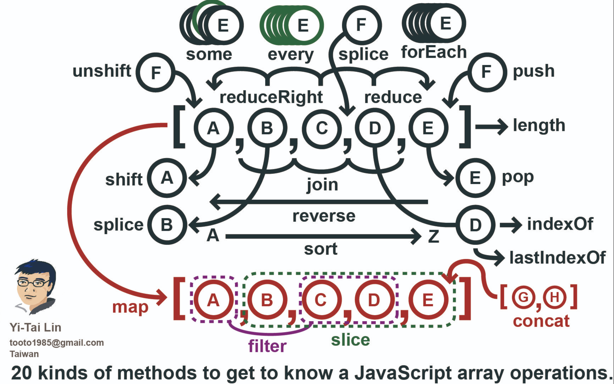
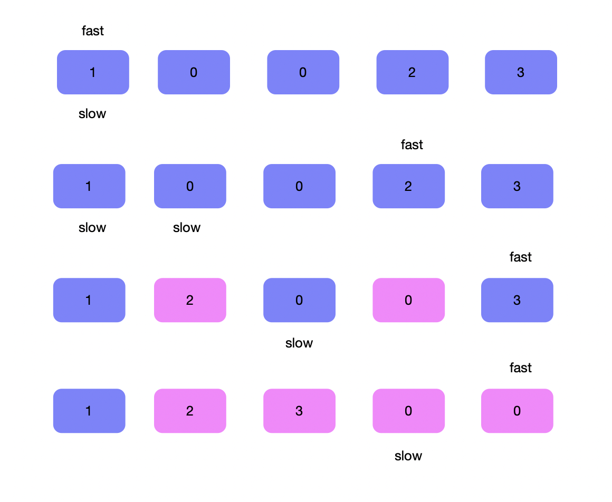

# 数组

数组的使用操作API



#### 常见的操作数组的API

| method | description |
| :--- | :---: |
| push | 在数组的尾部，新增一个元素，操作源数据源 |
| pop | 在数组的尾部，删除最后一个元素，操作源数据源 |
| shift | 在数组的首部，删除第一个元素，操作源数据源 |
| unshift | 在数组的首部，新增一个元素，操作源数据源 |
| splice | 在任意位置添加或者删除元素，改变了原数组 |
| concat | 合并数组，返回合并之后的数组，不会改变原数组 |
| every | 返回Boolean值，数组的每一个元素满足其条件，则返回true |
| filter | 返回一个新数组，根据某一个条件，过滤出符合条件的数组，不会改变原数组 |
| indexOf | 返回index，查找出满足条件元素的index（索引），其值是大于等于0 |
| map | 返回一个新数组，返回每次函数调用的结果组成的数组 |
| reverse | 数组中元素的位置反转，改变了原数组 |
| slice | 返回一个新数组，根据传入的参数的index范围，不会改变原来的数组 |
| some | 返回Boolean值，数组的其中一个元素满足其条件，则返回true |
| sort | 对数组中的元素进行排序，根据传入的指定的函数参数 |
| forEach | 遍历数组中每一个元素 |
| reduce | 累加器 |
| toString | 将数组转为字符串进行返回 |
| valueOf | 跟toString类似 |

#### ES6、ES7中数组的新功能

| method | description |
| :--- | :---: |
| @@iterator | 返回一个包含数组键值对的迭代器对象，可以通过同步调用得到数组元素的键值对 |
| copyWithin | 复制数组中的一系列元素到同一数组指定的起始位置 |
| entries | 反水包含数组所有键值对的@@iterator |
| includes | 如果数组中存在某个元素则返回true |
| find | 根据回调函数给定的条件从数组中查找元素 |
| findIndex | 根据回调函数给定的条件从数组中查找元素的index（索引） |
| fill | 用静态值填充数组 |
| from | 根据已有的数组创建一个新数组 |
| flat | 数据扁平 |
| keys | 返回包含数组所有索引的@@iterator |
| of | 根据传入的参数创建一个新数组 |
| values | 返回包含数组所有值得@@iterator |

### 数组的常见使用场景

在日常开发中以及业务场景中，使用数组数据结构的话，避免不了会对数据进行操作，也就避免不了在不同的场景下对数组的各种操作

#### 数组的遍历

数组的遍历非常常见，以及使用频率很高，着这里个人总结遍历数组的方法以及各自的差异

使用 **for** 语句

```javascript
let arr = [0,1,3,4]
for(let i = 0, len = arr.length; i < len; i++){
  console.log(arr[i])
}
```

使用 **forEach** 语句

```javascript
let arr = [0,1,3,4]
arr.forEach(function(e) {
  console.log(e)
})
// es6
arr.forEach(e => {
  console.log(e)
})
```

使用 **for-in** 语句

一般会使用for-in来遍历对象的属性的,不过属性需要 enumerable,才能被读取到. for-in 循环只遍历可枚举属性。一般常用来遍历对象，包括非整数类型的名称和继承的那些原型链上面的属性也能被遍历。像 Array和 Object使用内置构造函数所创建的对象都会继承自Object.prototype和String.prototype的不可枚举属性就不能遍历了.

注意: **for in 会遍历其原型链上的方法**

```javascript
let arr = [0,1,3,4]

let obj = {
  name: 'nate',
  age: 22,
  sex: 'man',
  height: 174
}

for(let key in obj) {
  console.log(obj[key])
}
```

使用 **for-of** 语句

for-of语句在可迭代对象（包括 Array，Map，Set，String，TypedArray，arguments 对象等等）上创建一个迭代循环，调用自定义迭代钩子，并为每个不同属性的值执行语句。只要是一个iterable的对象,就可以通过for-of来迭代.

```javascript
let arr = [0,{name: 'nate'}, '3',4]

for(let key of arr) {
  console.log(arr[key]) // 0 undefined undefined 4
}
```

使用 **map** 语句

```javascript
let arr = [{
  name: 'ruchal',
  age: 20
},{
  name: 'nate',
  age: 22
},{
  name: 'frank',
  age: 29
}]

arr.map(e => e.age) // [20, 22, 29]
```

使用 **filter** 语句

```javascript
let arr = [{
  name: 'ruchal',
  age: 20
},{
  name: 'nate',
  age: 22
},{
  name: 'frank',
  age: 29
}]

arr.filter(e => e.age > 20) // [{name: 'frank', age: 29}]
```

使用 **reduce** 语句

方法对累加器和数组中的每个元素（从左到右）应用一个函数，将其减少为单个值；除了回调参数之外，第二个参数作为第一次调用 callback函数时的第一个参数的值。 如果没有提供初始值，则将使用数组中的第一个元素。 在没有初始值的空数组上调用 reduce 将报错。

```javascript
// pre 累加结果，cur 当前值，curIndex 当前索引，arr 当前数组
[9,2,3,5].reduce((pre, cur, curIndex, arr) => {
  return pre + cur
}, []) // 19
```

**测试一下上述遍历方法的执行时间**

```javascript
let arr = [];
let aFor = 0;
let aForin = 0;
let aForof = 0;
let aForEach = 0;
let aMap = 0;

// setting dataSource
for(let i = 0; i < 1000000; i++) {
  arr.push(i)
}

// test for
console.time('for time');
for(let j = 0; j < arr.length; j++) {
  aFor += arr[j]
}
console.timeEnd('for time') // for time: 22.81298828125ms

// test for-in
console.time('forIn time');
for(let x in arr) {
  aForin += arr[x]
}
console.timeEnd('forIn time') // forIn time: 704.39013671875ms

// test for-of
console.time('forof time');
for(let x of arr) {
  aForof += arr[x]
}
console.timeEnd('forof time') // forof time: 32.671875ms

// test foreach
console.time('foreach time');
arr.forEach(e => {
  aForEach += e
})
console.timeEnd('foreach time') // foreach time: 32.298095703125ms

// test map
console.time('map time');
arr.map(e => {
  aMap += e
})
console.timeEnd('map time') // map time: 68.803955078125ms
```

这边测试遍历性能的话 需要大量的数据来支持，借鉴他人的数据测试，上述方法的性能大致有个优先级的排序：

**for** &gt; **forEach** &gt; **for-of** &gt; **map** &gt; **for-in**

#### 数组去重

在很多的业务场景下，数组都会需要去重，但是去重的场景也是不尽相同的，譬如：

1. 数组value是同一种类型
2. 数组value是不同的类型
3. 数组value是引用类型

**双层循环**

双层循环主要是定义一个要 return 的数组（已去重），遍历原数组以及新数组，如果两者的元素不等时，则此元素就不是重复元素

```javascript
var arr = [1, 2, '1', 3, 1];

var newArr = [];

for(var i = 0; i < arr.length; i++) {
  for(var j = 0; j < newArr.length; j++) {
    if(arr[i] === newArr[j]) {
      break;
    }
  }
  if(j === newArr.length) {
    newArr.push(arr[i])
  }
}
```

**indexOf - 01**

indexOf主要是遍历原数组，如果新数组中没有此元素，则添加到新数组中

```javascript
let arr = [1, 2, '1', 3, 1];

let newArr = [];

for(var i = 0; i < arr.length; i++) {
  if(newArr.indexOf(arr[i]) === -1) {
    newArr.push(arr[i])
  }
}
```

**indexOf - 02**

indexOf第二种方法判断重复元素第一次出现的位置和现在得位置是否相同

```javascript
function unique() {
  let arr = [1, 2, '1', 3, 1];
  return Array.prototype.filter.call(arr, (item, index) => {
    return arr.indexOf(item) === index
  })
}
```

**相邻元素**

相邻元素去重主要是先对数组进行排序，之后对相邻元素进行判断，如果不等，则添加

**这个方法有局限性：**数组元素的数据类型必须是同类型

```javascript
let arr = [1, 2, '1', 3, 1]; // print [1,'1',1, 2, 3]

let newArr = [];

let sarr = arr.sort()

for(let i = 0; i < sarr.length; i++) {
  if(sarr[i] !== sarr[i-1]) {
    newArr.push(sarr[i])
  }
}
```

**ES6语法基本类型**

```javascript
let arr = [1, 2, '1', 3, 1]; 
// 扩展运算符andset数据结构
let newArr = [...new Set(arr)];

// Array.from and set 数据结构
let newArr1 = Array.from(new Set(arr))
```

**E6语法引用类型**

```javascript
function removeDuplicates( arr, prop ) {
  let obj = {};
  return Object.keys(arr.reduce((prev, next) => {
    if(!obj[next[prop]]) obj[next[prop]] = next;
    return obj;
  }, obj)).map((i) => obj[i]);
}

function uniqueArray(a) {
  return [...new Set(a.map(o => JSON.stringify(o)))].map(s => JSON.parse(s))
}
```

### 二维数组多维数组

二维数组的访问以及二维数组的扁平化

#### 二维数组的定义以及访问

```javascript
Array.matrix = function(numrows, numcols, initial) {
  var arr = [];
  for(let i = 0; i < numrows; i++) {
    var col = [];
    for(let j = 0; j < numcols; j++) {
      col[j] = initial;
    }
    arr[i] = col;
  }
  return arr
}
let twoMatrix = Array.matrix(5, 3, 1)
console.log(twoMatrix)

// 二维数组的访问 按行/按列

let dataList = [[12,22,11],[11,2,3],[55,21,11]];

// 按行
for(let r = 0; r < dataList.length; r++) {
  let row = 0;

  for(let c = 0; c < dataList[r].length; c++) {
    row += dataList[r][c]
  }
  console.log(`row${r+1}:${row}`)
}
// 按列 每一维数组数量相同
for(let r = 0; r < dataList.length; r++) {
  let col = 0;
  for(let c = 0; c < dataList[r].length; c++) {
    col += dataList[c][r]
  }
  console.log(`col${r+1}:${col}`)
}
```

#### 多维数组的扁平化

**面试题**

```javascript
var arr = [1,2[3,4,[5,6,7],8,9],10]

// 嵌套数组的深度 默认是1
var depth = Infinity; 

// 使用 Array.prototype.flat IE不支持
var flatArr = arr.flat(depth)


// 使用reduce concat 
function flattenDeepd(arr) {
  return arr.reduce((acc, val) => { 
    return Array.isArray(val) ? acc.concat(flattenDeep(val)) : acc.concat(val)
  }, [])
}

// 使用map
function arrayDelayering(array) {
  var newArr = [];
  arr.map((item) => {
    if(Array.isArray(item)) {
      newArr.push.apply(newArr, this.arrayDelayering(item));
    }else {
      newArr.push(item);
    }
  })
  return newArr
}
```

### 数组类算法

解决数组类算法，通常用的方法以及技巧有`遍历` `哈希表` `前缀法` `排序` `二分法` `双指针` `滑动窗口` `贪心算法` 

下面根据不同的解题方式来整理对应的经典题目。

### 前缀法

[**724. 寻找数组的中心下标**](https://leetcode-cn.com/problems/find-pivot-index/)\*\*\*\*

为了了解前缀法，先来看一道题目 **724. 寻找数组的中心下标**


如上图所示， $$numi$$是所要计算的中心下标数值。 $$leftSum$$ 是左边数组的总和， $$rightSum $$ 是右侧数组的总和。

$$
totalSum = leftSum + numi + rightSum
$$

  要 $$leftSum$$ 和 $$rightSum$$ 相等，得出公式

$$
numi = totalSum - 2leftSum
$$

因此，下面为代码实现

```javascript
/**
 * @param {number[]} nums
 * @return {number}
 */
const pivotIndex = function(nums) {
  let totalSum = 0;
  let sum = 0;
  // 计算数组和
  for(let i = 0; i < nums.length; i++) {
    totalSum += nums[i]
  }
  
  for(let j = 0; j < nums.length; j++) {
    if(nums[j] == totalSum - 2 * sum) {
      return j
    }
    sum += nums[j]
  }
  return -1;
};
```


### 双指针法

双指针可以到 [「算法技巧系列 - 双指针模式」](../suan-fa-ji-qiao-xi-lie/shuang-zhi-zhen-mo-shi.md)查看，这里整理数组中有关双指针解法的题目

1. [283. 移动零](https://leetcode-cn.com/problems/move-zeroes/)
2. [27. 移除元素](https://leetcode-cn.com/problems/remove-element/)

#### 移动零

```javascript
题目：给定一个数组 nums，编写一个函数将所有 0 移动到数组的末尾，同时保持非零元素的相对顺序。
```



上图描述了使用快慢指针移动零的步骤，是简单的双指针应用

```javascript
const moveZero = (arr) => {
  let f = 0;
  let s = 0;
  let len = arr.length;

  while(f < len) {
    if(arr[f] != 0) {
      let tmp = arr[f];
      arr[f] = arr[s];
      arr[s]= tmp;
      s++
    }
    f++
  }
}
```

移动元素也是类似的算法题目。

