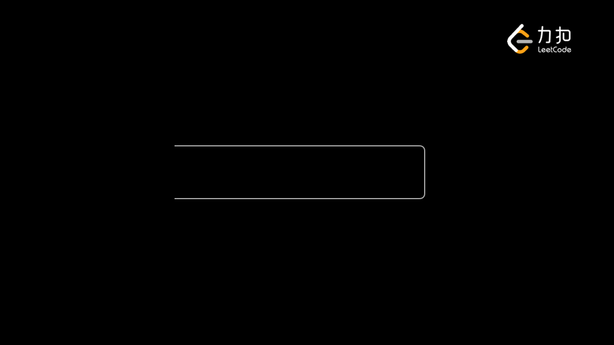

# 栈/队列

### 栈的实现



分别用ES5和ES6实现

#### ES5 实现栈

```javascript
// push methods
function append(e) {
  this.stackList.push(e)
}

// pop methods
function pop() {
  this.stackList.pop()
}

// peek methods
function peek() {
  return this.stackList[this.size() - 1]
}

// isEmpty methods
function isEmpty() {
  return !this.stackList.length
}

// clear methods
function clear() {
  this.stackList = []
}

// size methods
function size() {
  return this.stackList.length;
}

// Stack structure
function Stack() {
  this.stackList = [];
  this.append = append;
  this.pop = pop;
  this.peek = peek;
  this.isEmpty = isEmpty;
  this.clear = clear;
  this.size = size;
}

let stack = new Stack()

stack.append('1')
stack.append('2')
stack.append('2')

```

#### ES6 实现栈

```javascript
class Stack {
  constructor() {
    this.stackList = [];
  }
  append(e) {
    this.stackList.push(e);
  }
  pop() {
    this.stackList.pop();
  }
  peek() {
    return this.stackList[this.size() - 1];
  }
  isEmpty() {
    return !this.stackList.length;
  }
  clear() {
    this.stackList = [];
  }
  size() {
    return this.stackList.length;
  }
}
let stack = new Stack()

stack.append('1')
stack.append('2')
stack.append('2')
```

### 单调栈的实现

### 

### 

### 队列的实现

#### ES5 实现队列

```javascript
// 入队操作
function enqueue(ele) {
  this.dataSource.push(ele)
}
// 出队操作
function dequeue() {
  this.dataSource.shift()
}
// 返回队列第一个元素
function front() {
  return this.dataSource[0]
}
// 队列是否为空
function isEmpty() {
  return !!this.dataSource.length
}
// 队列的大小
function size() {
  return this.dataSource.length
}
// 队列结构
function Queue() {
  // 队列数据源
  this.dataSource = []
  // 入队操作
  this.enqueue = enqueue
  // 出队操作
  this.dequeue = dequeue
  // 返回队列中的第一个元素
  this.front = front
  // 队列是否为空
  this.isEmpty = isEmpty
  // 队列的大小
  this.size = size
}
let queue = new Queue()
queue.enqueue('baoqi')
queue.enqueue('wang')
console.log(queue.isEmpty()) // false
console.log(queue.size()) // 2
console.log(queue.front()) // baoqi
console.log(queue.dataSource) // ['baoqi', 'wang']
queue.dequeue()
console.log(queue.dataSource) // ['wang']
```

#### ES6 实现队列

```javascript
class Queue {
  constructor() {
    this.dataSource = []
  }
  enqueue(ele) {
    this.dataSource.push(ele)
  }
  dequeue() {
    this.dataSource.shift()
  }
  front() {
    return this.dataSource[0]
  }
  isEmpty() {
    return !this.dataSource.length
  }
  size() {
    return this.dataSource.length
  }
}


// 测试跟上述结果一致
```


